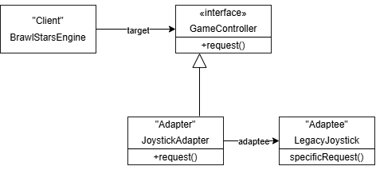

# Паттерн Adapter (Адаптер) в Python

## 1. Что это и зачем нужен?

**Паттерн Adapter** — это структурный паттерн проектирования, который позволяет объектам с **несовместимыми интерфейсами** работать вместе. Он выступает в роли «переходника» (адаптера) между двумя системами, не требуя изменений в их исходном коде.

**Главная идея:** клиент работает со знакомым ему интерфейсом, а адаптер незаметно преобразует вызовы в интерфейс «чужого» класса.

**Где полезен в играх:**
- Подключение старой системы управления к новому игровому движку
- Интеграция разных физических движков, библиотек анимации, звука или ИИ
- Работа с внешними API (платёжные системы, донат, социальные сервисы)

## 2. Аналогия из жизни: адаптер геймпада в мобильной игре

Представь, что ты разрабатываешь мобильную игру в стиле *Brawl Stars*.  
<div align="center">
  
</div>
<div align="center">
  <div style="margin-top: 30px;">
    <em>Игра недоступна на территории РФ</em>
  </div>
</div>
<br />

У тебя есть проверенный временем **класс управления джойстиком** из старых проектов. Он работает через методы `joystick_left()`, `joystick_right()`, `joystick_attack()` и т.д.

Но новый игровой движок ожидает современный интерфейс: `move(dx, dy)` и `attack(target)`.

Ты не хочешь переписывать ни старый джойстик (он сложный и хорошо отлаженный), ни весь новый движок. Решение — **паттерн Adapter**.

| В игре                        | В паттерне      |
|-------------------------------|-----------------|
| Новый игровой движок          | Client          |
| Интерфейс `move` / `attack`   | Target          |
| Старый класс джойстика        | Adaptee         |
| Обёртка-переходник            | Adapter         |

**Как это работает:**
1. Движок вызывает `move(1, 0)` — персонаж должен идти вправо.
2. Адаптер получает вызов и преобразует его в `joystick_right()`.
3. Старый джойстик выполняет действие.
4. Движок даже не знает, что внутри используется legacy-код.


## 3. Три главных героя паттерна

| Роль         | Обязанность                                                      | Пример в игре                          |
|--------------|------------------------------------------------------------------|----------------------------------------|
| **Target**   | Интерфейс, который ожидает клиент                                | `GameController` (`move()`, `attack()`) |
| **Adaptee**(адаптируемый)  | Существующий класс с несовместимым интерфейсом                   | `LegacyJoystick`                       |
| **Adapter**(сам адаптер)  | Реализует Target и преобразует вызовы в методы Adaptee           | `JoystickAdapter`                      |

## Схема



## 4. Пример: Адаптер управления бойцом в Brawl Stars

### 4.1 Без паттерна (как делать не нужно)

```python
class LegacyJoystick:
    """Старая система управления джойстиком"""
    def joystick_left(self):
        print("[Legacy] движение ВЛЕВО")
    
    def joystick_right(self):
        print("[Legacy] движение ВПРАВО")
    
    def joystick_up(self):
        print("[Legacy] движение ВВЕРХ")
    
    def joystick_down(self):
        print("[Legacy] движение ВНИЗ")
    
    def joystick_attack(self):
        print("[Legacy] АТАКА!")

class GameEngine:
    def __init__(self, joystick: LegacyJoystick):
        self.joystick = joystick
    
    def handle_input(self, key: str):
        if key == 'w':      self.joystick.joystick_up()
        elif key == 's':    self.joystick.joystick_down()
        elif key == 'a':    self.joystick.joystick_left()
        elif key == 'd':    self.joystick.joystick_right()
        elif key == ' ':    self.joystick.joystick_attack()
        else:
            print("Неизвестная команда")

# Использование
joystick = LegacyJoystick()
engine = GameEngine(joystick)
engine.handle_input('d')
engine.handle_input(' ')
```
Проблема: GameEngine сильно привязан к конкретной реализации LegacyJoystick. При смене системы управления придётся переписывать весь движок.
```python
from abc import ABC, abstractmethod

# 1. Target — интерфейс, который ожидает новый движок
class GameController(ABC):
    @abstractmethod
    def move(self, dx: int, dy: int):
        raise NotImplementedError("Метод move должен быть реализован в подклассе")

    @abstractmethod
    def attack(self):
        raise NotImplementedError("Метод attack должен быть реализован в подклассе")


# 2. Adaptee — старая система (не меняем)
class LegacyJoystick:
    def joystick_left(self):
        print("   └─ [LegacyJoystick] → движение ВЛЕВО")
    
    def joystick_right(self):
        print("   └─ [LegacyJoystick] → движение ВПРАВО")
    
    def joystick_up(self):
        print("   └─ [LegacyJoystick] → движение ВВЕРХ")
    
    def joystick_down(self):
        print("   └─ [LegacyJoystick] → движение ВНИЗ")
    
    def joystick_attack(self):
        print("   └─ [LegacyJoystick] → АТАКА!")


# 3. Adapter — "переходник" с подробными объяснениями
class JoystickAdapter(GameController):
    def __init__(self, legacy: LegacyJoystick):
        self._legacy = legacy
    
    def move(self, dx: int, dy: int):
        print(f"  → Adapter: получил команду move({dx}, {dy})")
        if dx > 0:
            self._legacy.joystick_right()
        elif dx < 0:
            self._legacy.joystick_left()
        if dy > 0:
            self._legacy.joystick_up()
        elif dy < 0:
            self._legacy.joystick_down()
    
    def attack(self):
        print("  → Adapter: получил команду attack()")
        self._legacy.joystick_attack()


# 4. Новый игровой движок (клиент)
class BrawlStarsEngine:
    def __init__(self, controller: GameController):
        self._controller = controller
    
    def process_command(self, cmd: str):
        print(f"\nEngine: получил команду от игрока → '{cmd}'")
        
        if cmd == 'move_right':
            self._controller.move(1, 0)
        elif cmd == 'move_left':
            self._controller.move(-1, 0)
        elif cmd == 'move_up':
            self._controller.move(0, 1)
        elif cmd == 'move_down':
            self._controller.move(0, -1)
        elif cmd == 'attack':
            self._controller.attack()
        else:
            print(f"Engine: неизвестная команда '{cmd}'")


# ==================== НАГЛЯДНАЯ ДЕМОНСТРАЦИЯ ====================
print("=== Паттерн Adapter в действии (наглядная версия) ===\n")

legacy_joystick = LegacyJoystick()
adapter = JoystickAdapter(legacy_joystick)
engine = BrawlStarsEngine(adapter)

# Список команд для демонстрации
demo_commands = ['move_right', 'move_up', 'attack', 'move_left', 'attack']

for command in demo_commands:
    engine.process_command(command)
```
## 5. Когда использовать паттерн Adapter???
Используйте, когда:

* Нужно использовать готовый класс, но его интерфейс не подходит
* Хочешь повторно использовать legacy-код или стороннюю библиотеку
* Необходимо унифицировать работу с несколькими разными классами под один интерфейс
* Клиентский код должен оставаться независимым от конкретных реализаций

Не используйте, если:

* Интерфейсы можно легко привести к общему виду через рефакторинг
* Разница между интерфейсами слишком большая (лучше написать новый класс)
* Адаптер начинает обрастать сложной бизнес-логикой (тогда лучше рассмотреть Facade или Bridge)

## 6. Итог
Паттерн Adapter состоит из трёх основных частей:

Target — ожидаемый клиентом интерфейс
Adaptee — существующий класс с несовместимым интерфейсом
Adapter — класс, который реализует Target и делегирует работу Adaptee

В Python благодаря утиной типизации можно обойтись без абстрактных классов, но использование ABC делает код более явным и поддерживаемым.
Главное преимущество: ты можешь подключать любые новые системы управления, не меняя код игрового движка. Достаточно создать новый адаптер.
Теперь, когда ты играешь в игры, помни: за плавным управлением персонажем часто стоит маленький, но очень полезный Adapter.